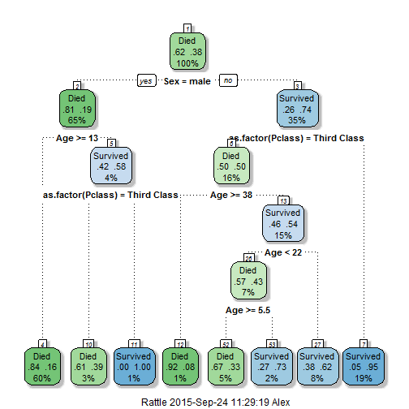
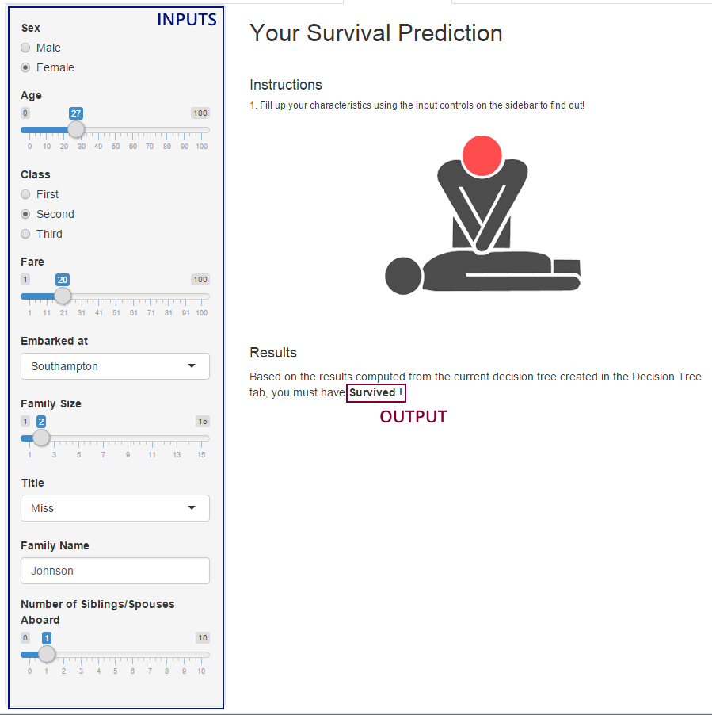

## Introduction

* The Titanic Survival Prediction app is an interactive shiny app that allows you to learn more about the sinking of the Titanic.

* There are <span style="color:#e67e22; font-weight:bold">4 tabs</span> in this app.
 * <span style="color:#f1c40f; font-weight:bold">Introduction</span>: Understand the background of the incident
 * <span style="color:#f1c40f; font-weight:bold">Exploratory Data Analysis</span>: Visualise the correlation between two variables as well as split the visualisation up by the desired variable
 * <span style="color:#f1c40f; font-weight:bold">Decision Tree</span>: Understand the key factors affecting passengers' chances of survival through Regression Trees
 * <span style="color:#f1c40f; font-weight:bold">Will you survive?</span>: Predict your fate had you been onboard the Titanic based on the plotted Decision Tree

---

## Understanding the Dataset

* Both the training and testing datasets were downloaded from the Kaggle website:
 * https://www.kaggle.com/c/titanic/data
 
* Data Preprocessing Steps:
 * Loading of Training & Testing Datasets
 
 
 ```r
  trainingDataset <- read.csv("../data/train.csv")
  testingDataset <- read.csv("../data/test.csv")
  summary(trainingDataset)
 ```
 
 ```
 ##   PassengerId       Survived          Pclass     
 ##  Min.   :  1.0   Min.   :0.0000   Min.   :1.000  
 ##  1st Qu.:223.5   1st Qu.:0.0000   1st Qu.:2.000  
 ##  Median :446.0   Median :0.0000   Median :3.000  
 ##  Mean   :446.0   Mean   :0.3838   Mean   :2.309  
 ##  3rd Qu.:668.5   3rd Qu.:1.0000   3rd Qu.:3.000  
 ##  Max.   :891.0   Max.   :1.0000   Max.   :3.000  
 ##                                                  
 ##                                     Name         Sex           Age       
 ##  Abbing, Mr. Anthony                  :  1   female:314   Min.   : 0.42  
 ##  Abbott, Mr. Rossmore Edward          :  1   male  :577   1st Qu.:20.12  
 ##  Abbott, Mrs. Stanton (Rosa Hunt)     :  1                Median :28.00  
 ##  Abelson, Mr. Samuel                  :  1                Mean   :29.70  
 ##  Abelson, Mrs. Samuel (Hannah Wizosky):  1                3rd Qu.:38.00  
 ##  Adahl, Mr. Mauritz Nils Martin       :  1                Max.   :80.00  
 ##  (Other)                              :885                NA's   :177    
 ##      SibSp           Parch             Ticket         Fare       
 ##  Min.   :0.000   Min.   :0.0000   1601    :  7   Min.   :  0.00  
 ##  1st Qu.:0.000   1st Qu.:0.0000   347082  :  7   1st Qu.:  7.91  
 ##  Median :0.000   Median :0.0000   CA. 2343:  7   Median : 14.45  
 ##  Mean   :0.523   Mean   :0.3816   3101295 :  6   Mean   : 32.20  
 ##  3rd Qu.:1.000   3rd Qu.:0.0000   347088  :  6   3rd Qu.: 31.00  
 ##  Max.   :8.000   Max.   :6.0000   CA 2144 :  6   Max.   :512.33  
 ##                                   (Other) :852                   
 ##          Cabin     Embarked
 ##             :687    :  2   
 ##  B96 B98    :  4   C:168   
 ##  C23 C25 C27:  4   Q: 77   
 ##  G6         :  4   S:644   
 ##  C22 C26    :  3           
 ##  D          :  3           
 ##  (Other)    :186
 ```

---

## Cleaning the Dataset

* In order to achieve more accurate results, data cleaning was performed to detect and remove errors and inconsistencies.

 * Similar Family Titles were combined
 
 ```r
    combinedDataset$Title[combinedDataset$Title %in% c('Mlle', 'Ms')] <- 'Miss'
    combinedDataset$Title[combinedDataset$Title == 'Mme'] <- 'Mrs'
 ```
 
 * Missing Age values were imputed
 
 ```r
    ageFit <- rpart(Age ~ Pclass + Sex + SibSp + Parch + Fare + Title + FamilySize,
                    data = combinedDataset[!is.na(combinedDataset$Age),],
                    method = "anova")
 ```
 
 * Missing Fare values were imputed
 
 ```r
    combinedDataset$Fare[which(is.na(combinedDataset$Fare))] <- median(combinedDataset$Fare, na.rm = TRUE)
 ```

---

## Building a Predictive Model

* After cleaning up the data, a predictive model was built using the Recursive Partitioning and Regression Trees function, `rpart`.


  

```r
fitModel <- rpart(Survived ~ as.factor(Pclass) + Sex + Age, data = trainingDataset, method = "class")
fancyRpartPlot(fitModel)
```

 

---

## Predicting your Survivability

* Based on the current decision tree and inputs, the shiny app predicts whether you <span style="color:#2ecc71; font-weight:bold">survived</span> or <span style="color:#e74c3c; font-weight:bold">died</span> when the Titanic sank.

<div style='text-align: center;'>
    
</div>
